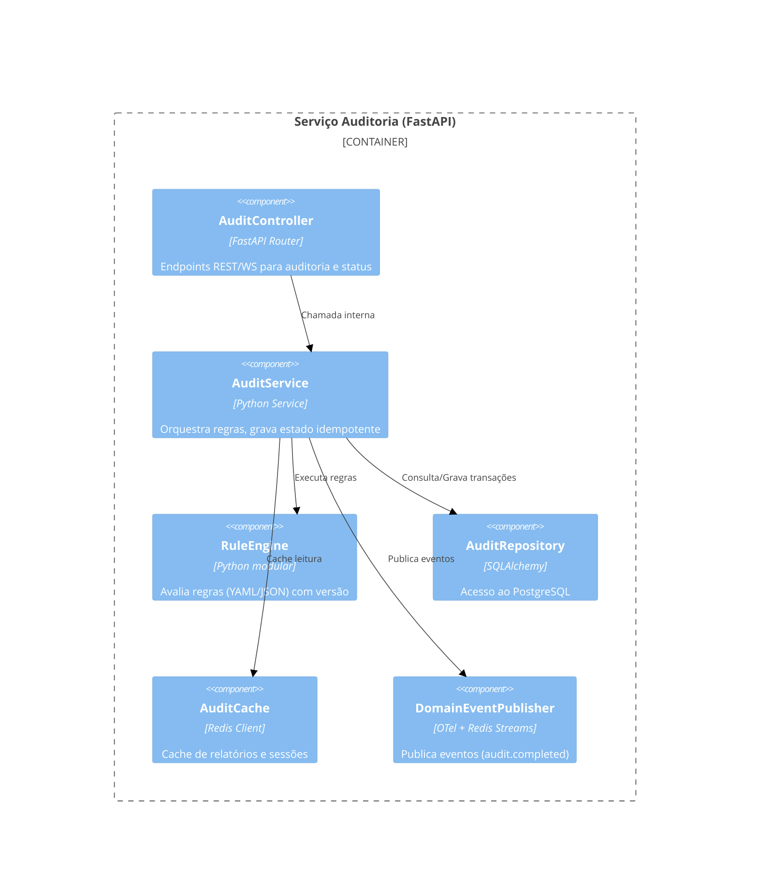

# C4 Model — Nexus QuantumI2A2

> **Escopo**: arquitetura alvo proposta na auditoria (ver `docs/audit-report.md`). Diagramas em notação textual (Mermaid C4) para fácil versionamento.

## Nível 1 — Contexto do Sistema
```mermaid
%%{init: {'theme': 'neutral', 'themeVariables': { 'fontSize': '14px' }}}%%
C4Context
    Person(user, "Analista Fiscal", "Usuário interno que carrega documentos, acompanha auditorias e interage com o chat IA.")
    Person(extAuditor, "Auditor Externo", "Acessa relatórios através de escopos restritos.")
    System_Boundary(nexus, "Nexus QuantumI2A2") {
        System(spa, "Frontend React", "Interface existente (SPA) consumida via navegador.")
        System(bff, "BFF/API Gateway", "Camada de orquestração, autenticação, caching e rate limiting.")
        System(auditSvc, "Serviço de Auditoria Fiscal", "Executa regras determinísticas, conciliações e consolida métricas.")
        System(aiSvc, "Serviço de Inteligência IA", "Encapsula promts e chamadas ao Google Gemini, cuidando de quotas e observabilidade.")
        System(ingestSvc, "Serviço de Ingestão & OCR", "Realiza upload seguro, normalização, OCR/extração inicial e armazenamento em fila.")
        System(pipelineWorkers, "Workers Celery", "Processam lotes em background, garantindo idempotência e retries.")
        SystemDb(db, "PostgreSQL", "Persistência relacional normalizada (documentos, auditorias, reconciliações, usuários).")
        SystemQueue(redis, "Redis/Msg Queue", "Filas, cache, rate limiting e dead-letter queue.")
        System(otel, "Observabilidade", "OpenTelemetry Collector + Prometheus/Loki/Tempo.")
    }
    System_Ext(googleGemini, "Google Gemini API", "Modelo generativo externo.")
    System_Ext(sapErp, "ERPs/Legados", "Fontes externas opcionais (SAP, Oracle, etc.) para conciliação.")

    Rel(user, spa, "Opera via browser, OAuth2/OIDC")
    Rel(spa, bff, "REST/GraphQL, HTTPS (mutual TLS opcional)")
    Rel(bff, ingestSvc, "Upload & criação de jobs (REST v1)")
    Rel(bff, auditSvc, "Consultas, dashboards, relatórios")
    Rel(bff, aiSvc, "Solicita insights IA (REST v1/v2)")
    Rel(ingestSvc, redis, "Enfileira jobs", "Idempotent enqueue")
    Rel(pipelineWorkers, redis, "Consome jobs")
    Rel(pipelineWorkers, db, "Persistência")
    Rel(aiSvc, googleGemini, "Chamada API (Key Vault)")
    Rel(auditSvc, sapErp, "Integrações opc.", "ETL/Streaming")
    Rel(otel, [ingestSvc, auditSvc, aiSvc, bff, spa], "Coleta traces/logs/métricas")
```

## Nível 2 — Containers
| Container | Stack | Responsabilidade | Interfaces | Observabilidade |
| --- | --- | --- | --- | --- |
| SPA React | React 19, Vite | UI existente; interage via BFF; WebSocket para streaming | REST (JSON), WebSocket | Web Vitals, traces via `@opentelemetry/api` |
| BFF/API Gateway | FastAPI (Python) ou NestJS (Node) | AuthN/Z, rate limiting, agregação, cache HTTP | REST `/v1`, `/v2`, GraphQL opcional; gRPC interno | Traceparent propagation, métricas (latência, rate-limit hits) |
| Serviço Ingestão | FastAPI + Uvicorn | Upload seguro, validação, chunked streaming, idempotência | REST multipart, callbacks (webhook), events queue | `ingestion_requests_total`, `queue_latency_seconds` |
| Workers Celery | Python, Celery, Redis | OCR/Tesseract, parsing, pipelines, conciliação | Fila Celery, events | `worker_busy_gauge`, `task_failure_total` |
| Serviço Auditoria | FastAPI | Regras fiscais, storage, geração dashboards | REST, WebSocket para progress | `audit_duration_seconds`, `n+1_detector` |
| Serviço IA | FastAPI | Prompt mgmt, quotas, cache, compliance | REST, WebSocket streaming | `gemini_quota_remaining`, `prompt_latency_seconds` |
| PostgreSQL | PaaS (Cloud SQL) | Persistência ACID | SQL, read replicas | `db_connections`, `query_p95_ms` |
| Redis | Redis Cluster | Filas, cache, DLQ | Redis protocol | `queue_depth`, `hit_ratio` |
| Observabilidade | OTel Collector + Prometheus/Grafana/Loki | Consolida telemetria | OTLP, PromQL, LogQL | SLO dashboards, alerting |

## Nível 3 — Componentes (Serviço de Auditoria)


## Nível 4 — Exemplos de fluxos críticos
### Upload → Auditoria → Dashboard
1. SPA autentica usuário (OIDC) e envia arquivos para BFF (chunked + `Idempotency-Key`).
2. BFF valida escopos, passa token de serviço para Ingestão.
3. Ingestão grava metadata inicial no PostgreSQL, enfileira job Celery (`audit_job_created`), responde 202 Accepted com `job_id`.
4. Worker executa OCR/parse, chama AuditService, gera relatório, persiste e publica evento `audit.completed`.
5. AuditService atualiza status; BFF expõe WebSocket que notifica SPA com progresso.
6. SPA consulta `/reports/{job_id}` (cacheable). Métricas/traces capturadas via OpenTelemetry.

### Chat IA contextualizado
1. SPA solicita token de sessão via BFF.
2. BFF chama Serviço IA com `report_id`, que busca dados no PostgreSQL, pré-processa e envia prompt ao Gemini.
3. Resposta stream via WebSocket; transcripts e métricas registrados (latência, uso de tokens).

## Observações
- Diagramas devem ser exportados para documentação visual (PlantUML, Structurizr) caso necessário.
- C4 será atualizado a cada ADR relevante; manter sincronia com `docs/adr/`.

